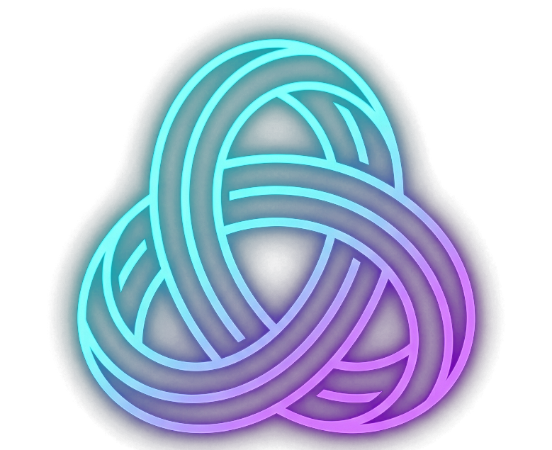

<div align="center">

<a href="#-key-features">
  
</a>

# Kizuna · 絆

**Your homelab. One control plane.**

[](https://github.com/maruf-pfc/kizuna/actions)
[](https://hub.docker.com/r/marufsarker/kizuna)
[](Dockerfile)
[](cmd/kizuna)
[](https://goreportcard.com/report/github.com/maruf-pfc/kizuna)
[](LICENSE)
[](https://github.com/maruf-pfc/kizuna)

<p align="center">
  <em>An ultra-lightweight, single-binary homelab control plane that integrates, aggregates, correlates, and visualizes your infrastructure without replacing specialized tools.</em>
</p>

---

**[📖 Documentation Hub](docs/)** •
**[📑 User Manual](docs/USER_MANUAL.md)** •
**[🏗️ Technical Architecture](docs/ARCHITECTURE.md)** •
**[🔌 Integrations Guide](docs/INTEGRATIONS.md)** •
**[🤝 Contributing](docs/CONTRIBUTING.md)**

**Translations:**
[🇯🇵 日本語](docs/i18n/USER_MANUAL.ja.md) &nbsp;•&nbsp;
[🇪🇸 Español](docs/i18n/USER_MANUAL.es.md) &nbsp;•&nbsp;
[🇩🇪 Deutsch](docs/i18n/USER_MANUAL.de.md) &nbsp;•&nbsp;
[🇨🇳 简体中文](docs/i18n/USER_MANUAL.zh-CN.md)

</div>

---

## 🧭 Philosophy & Non-Goals

Homelab operators don't need another heavy enterprise monitoring stack that consumes more RAM and CPU than the services it monitors.

- **Integrate, don't replace**: Kizuna connects to Docker, Proxmox VE, and Uptime Kuma rather than trying to reimplement them.
- **Single Binary / Single Container**: No Redis, Kafka, Elasticsearch, or background microservice sprawl.
- **Embedded SQLite (WAL)**: Zero configuration, pure-Go database driver (`modernc.org/sqlite`) with CGO-free static compilation.
- **Sub-15ms Responses**: Low latency, lightweight goroutines, and zero polling memory leaks.

```
                  +-----------------------------------+
                  |         Kizuna Web UI             |
                  |  (React 19 + TypeScript + Vite)   |
                  +-----------------+-----------------+
                                    | (REST API / SSE)
                                    v
+-----------------------------------------------------------------------+
|                       Kizuna Core Control Plane                       |
|                                                                       |
|   [ Command Palette (⌘K) ]   [ Alert Aggregator ]   [ Optimizer ]     |
|   [ Dependency Graph Engine ] [ Resource Intelligence Engine ]        |
|                                                                       |
|   +---------------------------------------------------------------+   |
|   |                  Embedded SQLite Database (WAL)               |   |
|   +---------------------------------------------------------------+   |
+--------+--------------------------+--------------------------+--------+
         |                          |                          |
         v                          v                          v
  [ Native Docker ]         [ Proxmox VE API ]         [ Uptime Kuma ]
  /var/run/docker.sock      https://pve-host:8006      Status Telemetry
```

---

## ✨ Key Features

- ⚡ **Global Command Palette (`⌘K` / `Ctrl+K`)**: Keyboard-first search across all registered services, physical hosts, and container workloads.
- 🐳 **Native Docker Socket Driver**: Direct `/var/run/docker.sock` communication over Unix sockets with zero 3rd-party Docker SDK dependencies (< 25 MB image footprint). Supports safe container lifecycle controls (Restart, Stop with confirmation guard, Start).
- 🖥️ **Proxmox VE & Hypervisor Driver**: Auto-discovers physical nodes, CPU cores, RAM pressure, ZFS storage pool occupancy, and LXC containers via API Token auth.
- ⏱️ **Uptime Kuma Sync**: Ingests heartbeat telemetry, monitor status (up/down/pending), uptime percentages, and ping latencies.
- 🌡️ **Hardware & Thermal Telemetry**: Reads host CPU core temperatures via Linux `/sys/class/thermal` and memory allocation from `/proc/meminfo`.
- 🕸️ **Infrastructure Topology & Blast Radius**: Interactive 3-tier dependency matrix. Selecting any node dynamically calculates its cascading outage blast radius.
- 🚨 **Unified Alert & Incident Management**: Correlates multi-service flapping into single root-cause incident timelines with Prometheus webhook ingestion.
- 📈 **24-Hour Telemetry Sparklines**: Lightweight, responsive SVG sparkline curves for Fleet CPU, RAM Pressure, ZFS Allocation, and Latency.
- 💡 **Resource Intelligence & Waste Optimizer**: Detects unreferenced Docker images, dangling volumes, and memory limit bottlenecks with a built-in **Dry-Run Simulation Mode**.

---

## 🚀 Quickstart

### Option 1: Docker Compose (Recommended)

```yaml
services:
  kizuna:
    image: marufsarker/kizuna:latest
    container_name: kizuna
    restart: unless-stopped
    ports:
      - "8080:8080"
    environment:
      - KIZUNA_HOST=0.0.0.0
      - KIZUNA_PORT=8080
      - KIZUNA_DB_PATH=/app/data/kizuna.db
      - KIZUNA_DEMO_MODE=false
      - KIZUNA_DOCKER_SOCKET=/var/run/docker.sock
    volumes:
      - ./data:/app/data
      - /var/run/docker.sock:/var/run/docker.sock:ro
```

Run:
```bash
docker compose up -d
```
Access the control plane at **`http://localhost:8080`**.

---

### Option 2: Run Single Binary

Download the compiled binary for your architecture from [Releases](https://github.com/maruf-pfc/kizuna/releases):

```bash
# Run standalone binary
./kizuna

# Run in Demo Mode with simulated homelab datasets
KIZUNA_DEMO_MODE=true ./kizuna
```

---

### Option 3: Build from Source

```bash
# Clone repository
git clone https://github.com/maruf-pfc/kizuna.git
cd kizuna

# Build frontend and single static binary
make build

# Run unit tests with race detection
make test

# Launch Kizuna
./bin/kizuna
```

---

## ⚙️ Configuration Reference

All settings can be configured via environment variables or a `.env` file:

| Variable | Default | Description |
| :--- | :--- | :--- |
| `KIZUNA_PORT` | `8080` | HTTP port for the web UI and API |
| `KIZUNA_HOST` | `0.0.0.0` | Bind host address |
| `KIZUNA_DB_PATH` | `kizuna.db` | Path to SQLite database file |
| `KIZUNA_DEMO_MODE` | `true` | Enables built-in realistic demo dataset |
| `KIZUNA_DOCKER_SOCKET`| `/var/run/docker.sock` | Path to local Docker engine Unix socket |
| `KIZUNA_PROXMOX_URL` | `""` | Base URL for Proxmox VE (e.g. `https://192.168.1.100:8006`) |
| `KIZUNA_PROXMOX_TOKEN_ID` | `""` | Proxmox API Token ID (`USER@REALM!TOKENID`) |
| `KIZUNA_PROXMOX_TOKEN_SECRET` | `""` | Proxmox API Token Secret UUID |
| `KIZUNA_PROXMOX_SKIP_VERIFY` | `true` | Allow self-signed TLS certificates for Proxmox |
| `KIZUNA_UPTIME_KUMA_URL` | `""` | Base URL for Uptime Kuma instance |

---

## 📡 API Endpoints

| Method | Path | Description |
| :--- | :--- | :--- |
| `GET` | `/api/v1/health` | Control plane operational healthcheck |
| `GET` | `/api/v1/dashboard` | Homelab high-level health summary and vitals |
| `GET` | `/api/v1/services` | Service catalog with live health and latency |
| `GET` | `/api/v1/hosts` | Physical hosts, nodes, and hypervisor statuses |
| `GET` | `/api/v1/containers` | Tracked container workloads and memory usage |
| `POST` | `/api/v1/containers/{id}/restart` | Safely restart container workload |
| `POST` | `/api/v1/containers/{id}/stop` | Safely stop container workload |
| `POST` | `/api/v1/containers/{id}/start` | Start container workload |
| `GET` | `/api/v1/dependencies` | Infrastructure topology nodes and dependency edges |
| `GET` | `/api/v1/alerts` | Unified operational alert stream |
| `POST` | `/api/v1/alerts/{id}/ack` | Acknowledge active alert |
| `POST` | `/api/v1/alerts/{id}/resolve` | Mark alert as resolved |
| `POST` | `/api/v1/alerts/webhook` | Webhook ingestion endpoint for Prometheus / custom alerts |
| `GET` | `/api/v1/metrics/trends` | 24-hour historical telemetry series (CPU, RAM, ZFS, Latency) |
| `GET` | `/api/v1/incidents` | Correlated cascade incidents and failure timelines |
| `GET` | `/api/v1/recommendations` | Resource intelligence optimization items |
| `POST` | `/api/v1/optimizer/execute` | Execute safe waste reclaim (supports `dry_run: true`) |
| `POST` | `/api/v1/optimizer/recommendations/{id}/dismiss` | Dismiss recommendation item |
| `GET` | `/api/v1/self/metrics` | Kizuna control plane internal memory/goroutine metrics |
| `GET` | `/api/v1/search?q={query}` | Global search index query |

---

## 🌐 Community & Documentation Translations

Help us make Kizuna accessible to homelabbers worldwide! Check out the [Translation Guide](docs/i18n/README.md) to contribute a translation in your language.

---

## 📄 License

Kizuna is open-source software licensed under the [MIT License](LICENSE).
